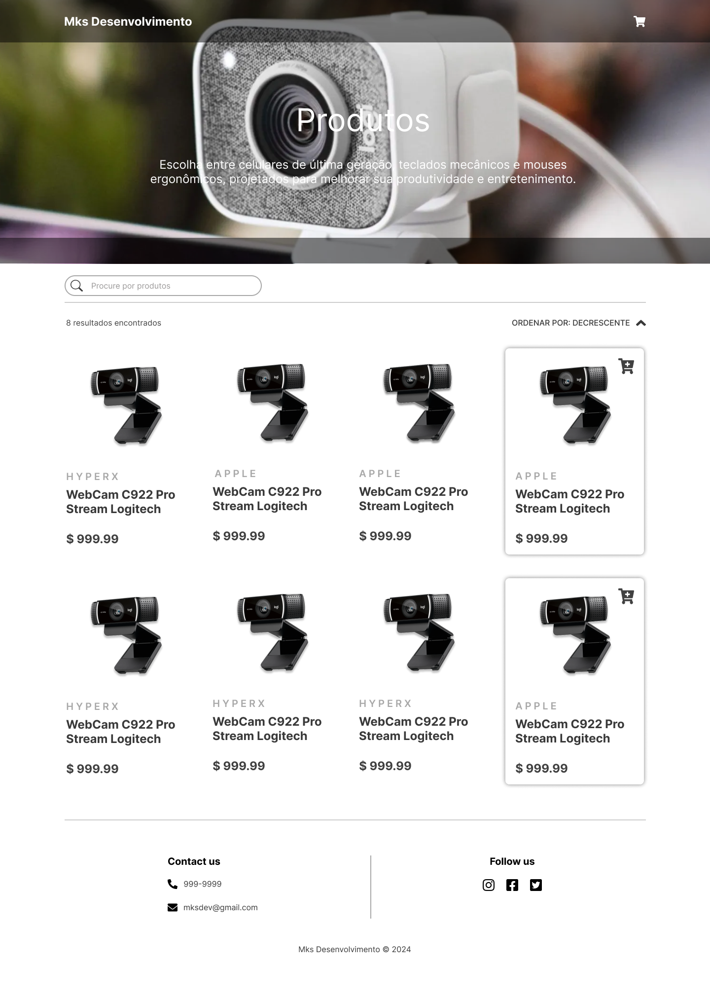

# Projeto Mks Desenvolivmento

[Clique aqui](https://github.com/Thiago1223/projeto-mks)

[Figma](https://www.figma.com/design/8GnLmPs7gekZPGOj4N7nli/Teste-Mks?node-id=1-2&t=lQwZwflbR0zlOEPu-0)

[Link para acessar o site](https://projeto-mks-ten.vercel.app/)

# Sobre

Este projeto foi desenvolvido como um e-commerce para teste na empresa Mks Desenvolvimento de sistemas. Utilizamos as tecnologias mencionadas abaixo para criar uma experiência de usuário dinâmica e responsiva.

## Tecnologia utilizada 

- TypeScript
- React
- Jest
- CSS
- Vercel (para hospedagem)
- Figma

## Autores
- [Thiago Freitas](https://github.com/Thiago1223)
